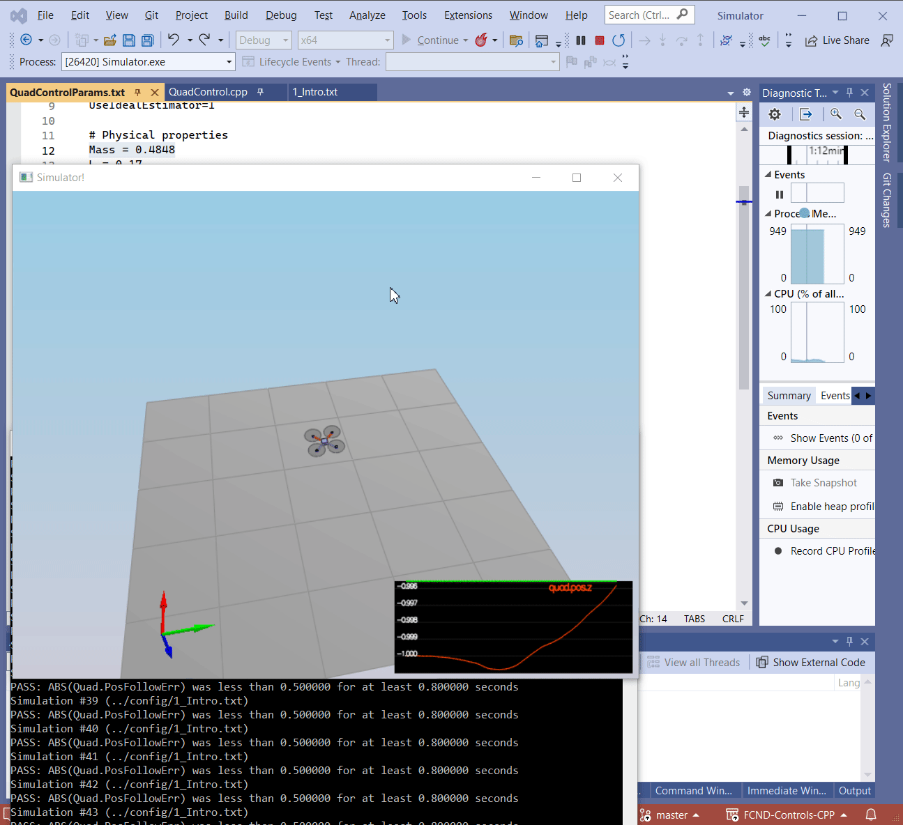

# Project: Building a Controller  

***
## All Required Steps for a Passing Submission have been completed:

1. The Writeup is created. 
2. The Controller has been Implemented.
3. My C++ controller is successfully able to fly the provided test trajectory   
   and visually passes inspection of the scenarios leading up to the test trajectory.

***
## [Rubric Points](https://review.udacity.com/#!/rubrics/1643/view) 
 Here I will consider the rubric points individually and describe how I addressed each point in my implementation.  

___
### 1. Writeup / README

_Provide a Writeup / README that includes all the rubric points and how you addressed each one._  

Current document is the **Writeup**

___
### 2. Implemented Controller   
#### *Setup*
   The development envirounment has been successfuly astableshed and   
 the first touch to code (_*Testing it Out*_) has passed with `Mass = 0.4848` 

___
#### 2.1 Implemented body rate control in C++.  
Use the following conversions to calculate the propeller angular velocities:

___
2.2. Implement roll pitch control in C++.  

___
2.3. Implement altitude controller in C++.

___
2.4. Implement lateral position control in C++.

___
2.5. Implement yaw control in C++.

___
2.6. Implement calculating the motor commands given commanded thrust and moments in C++.

___

