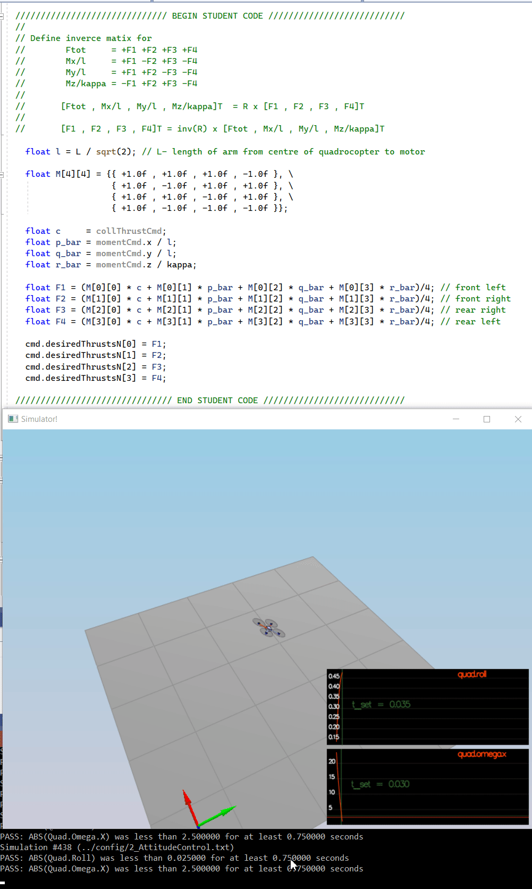
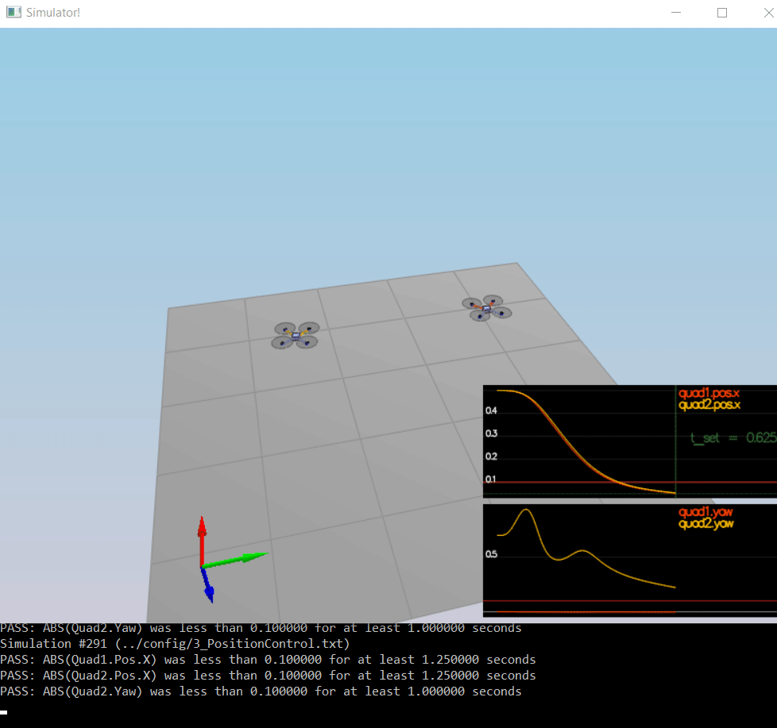
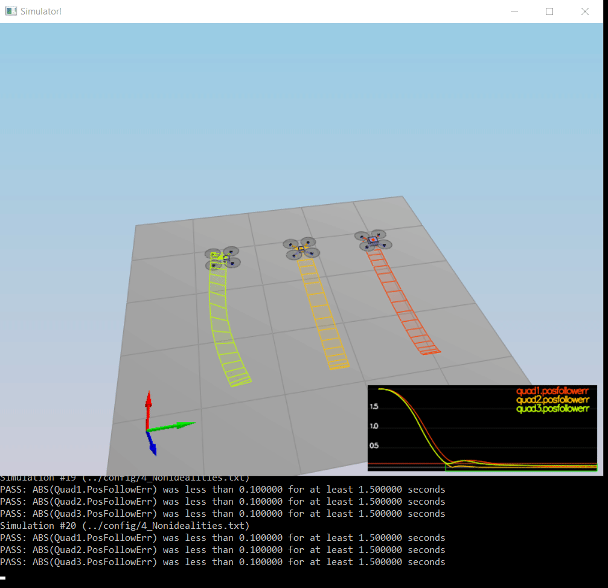
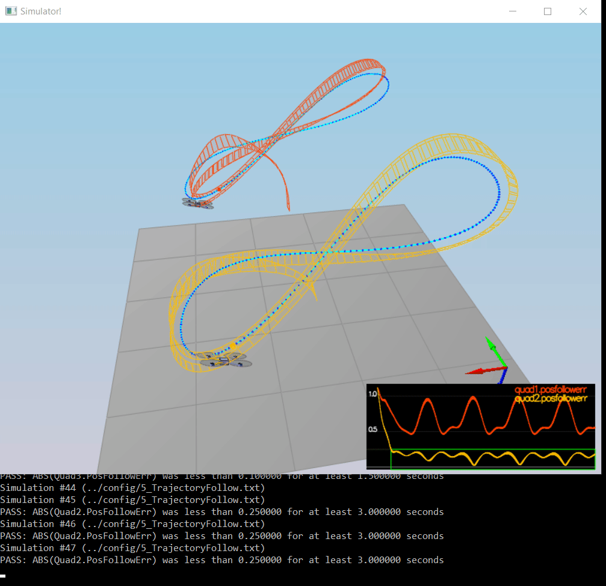

# Project: Building a Controller  

***
## All Required Steps for a Passing Submission have been completed:

1. The Writeup is created. 
2. The Controller has been Implemented.
3. My C++ controller is successfully able to fly the provided test trajectory   
   and visually passes inspection of the scenarios leading up to the test trajectory.

***
## [Rubric Points](https://review.udacity.com/#!/rubrics/1643/view) 
 Here I will consider the rubric points individually and describe how I addressed each point in my implementation.  

___
### 1. Writeup / README

_Provide a Writeup / README that includes all the rubric points and how you addressed each one._  

Current document is the **Writeup**

___
### 2. Implemented Controller   
#### *Setup*
   The development environment has been successfully established and   
 the first touch to code (_*Testing it Out*_) has passed with `Mass = 0.4848` 
<p align="center">

</p>

___
#### 2.1 Implemented body rate control in C++. 
I use the following math in the GenerateMotorCommands()
```code
  // Define inverce matix for 
  //        Ftot     = +F1 +F2 +F3 +F4  
  //        Mx/l     = +F1 -F2 +F3 -F4  
  //        My/l     = +F1 +F2 -F3 -F4  
  //        Mz/kappa = -F1 +F2 +F3 -F4  
  //      
  //       [Ftot , Mx/l , My/l , Mz*kappa]T  = R x [F1 , F2 , F3 , F4]T
  // 
  //       [F1 , F2 , F3 , F4]T = inv(R) x [Ftot , Mx/l , My/l , Mz/kappa]T
```


BodyRateControl()
```code
  V3F pqr_err = (pqrCmd - pqr);
  V3F I(Ixx,Iyy,Izz);
  momentCmd = I * kpPQR * pqr_err;
```
Setting the `kpPQR` to (83, 83, 20) lets to pass the scenario 2.

___
The following gif image demonstrates the control behaviour   
after implementing the `RollPitchControl()` and setting the `kpBank = 1`:

<p align="center">

</p>

___

### Position/velocity and yaw angle control (scenario 3)
- _*Implement altitude controller in C++.*_  
I've used PID controller to stabilize the altitude where:  
  k_p_z = `kpVelZ * kpPosZ`  
  k_d_z = `kpVelZ`  
  k_i_z = `KiPosZ`   
 
The acceleration on global Z axes is :  
  `u1_bar = kpVelZ * kpPosZ * posZ_err + kpVelZ * velZ_err + KiPosZ * integratedAltitudeError + accelZCmd`  

Taking into account that thrust has a negative direction in respect to the Z-axis :  
`thrust = -mass * (u1_bar - 9.81f) / R(2, 2);`  

___
- _*Implement lateral position control in C++.*_  
Here I use PD controller, where  
  k_p_xy = `kpVelXY * kpPosXY`  
  k_d_xy = `kpVelXY`  
A new function `V3F ClipV3F(V3F vector, float limit);` limits the magnitude of a 3D vector to a certain value.  
I've used it to limit the XY speed and the XY acceleration.  

___
- _*Implement yaw control in C++.*_  
```code
  float yawErr = fmodf(yawCmd - yaw, 2.0f * (float)F_PI) ;
  if (yawErr > (float)F_PI) {
      yawErr -= (2.0f * (float)F_PI);
  }
  else if (yawErr < -(float)F_PI) {
      yawErr += (2.0f * (float)F_PI);
  }
  yawRateCmd = kpYaw * yawErr;
```
The following image demonstrates the success of the controller in the scenario-3

<p align="center">

</p>


___
### Non-idealities and robustness (scenario 4)  
___

The AltitudeControl() utilises a PID controller , where:
 
`P =  kpPosZ`
`I = KiPosZ`
`D = kpVelZ*kpPosZ`

Using the following tuning parameters , the controller successfully PASS the scenario-04: 
```commandline
# Position control gains
kpPosXY = 3
kpPosZ = 8
KiPosZ = 1

# Velocity control gains
kpVelXY = 10
kpVelZ = 10

# Angle control gains
kpBank = 12
kpYaw = 2

# Angle rate gains
kpPQR = 50,50,20
```
<p align="center">

</p>

___
### Tracking trajectories (scenario 5)

In order to pass the scenario 5 , I've released a bit the altitude control,   
but activated the `I` part of the PID altitude controller.  
The below tuning set allows pretty fluently passing all the required scenarios.  
```commandline
# Position control gains
kpPosXY = 3
kpPosZ = 3
KiPosZ = 15000

# Velocity control gains
kpVelXY = 10.5
kpVelZ = 12

# Angle control gains
kpBank = 15
kpYaw = 2

# Angle rate gains
kpPQR = 50,50,30
```

<p align="center">

</p>

___
## Summery 
The controller has been implemented and all required scenarios successfully pass.