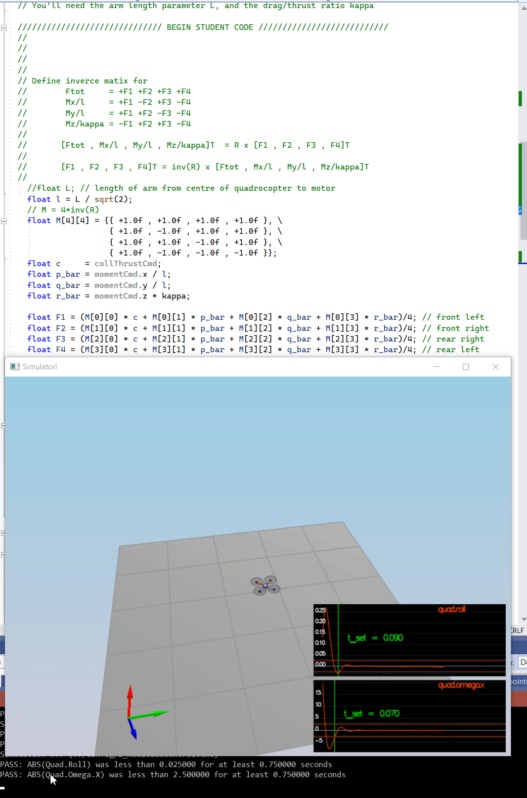

# Project: Building a Controller  

***
## All Required Steps for a Passing Submission have been completed:

1. The Writeup is created. 
2. The Controller has been Implemented.
3. My C++ controller is successfully able to fly the provided test trajectory   
   and visually passes inspection of the scenarios leading up to the test trajectory.

***
## [Rubric Points](https://review.udacity.com/#!/rubrics/1643/view) 
 Here I will consider the rubric points individually and describe how I addressed each point in my implementation.  

___
### 1. Writeup / README

_Provide a Writeup / README that includes all the rubric points and how you addressed each one._  

Current document is the **Writeup**

___
### 2. Implemented Controller   
#### *Setup*
   The development envirounment has been successfuly astableshed and   
 the first touch to code (_*Testing it Out*_) has passed with `Mass = 0.4848` 
<p align="center">

</p>

___
#### 2.1 Implemented body rate control in C++. 
I use the following math in the GenerateMotorCommands()
```code
  // Define inverce matix for 
  //        Ftot     = +F1 +F2 +F3 +F4  
  //        Mx/l     = +F1 -F2 +F3 -F4  
  //        My/l     = +F1 +F2 -F3 -F4  
  //        Mz/kappa = -F1 +F2 +F3 -F4  
  //      
  //       [Ftot , Mx/l , My/l , Mz*kappa]T  = R x [F1 , F2 , F3 , F4]T
  // 
  //       [F1 , F2 , F3 , F4]T = inv(R) x [Ftot , Mx/l , My/l , Mz*kappa]T
```


BodyRateControl()
```code
  V3F pqr_err = (pqrCmd - pqr);
  V3F I(Ixx,Iyy,Izz);
  momentCmd = I * kpPQR * pqr_err;
```
Setting the `kpPQR` to (83, 83, 20) is allow to pass the scenario 2.

___
The following gif image demonstrates the control behaiour   
after implemnting the `RollPitchControl()` and setting the `kpBank = 1`:

<p align="center">

</p>

___
- Implement altitude controller in C++.

___
2.3. Implement lateral position control in C++.

___
2.5. Implement yaw control in C++.

___
2.6. Implement calculating the motor commands given commanded thrust and moments in C++.

___


